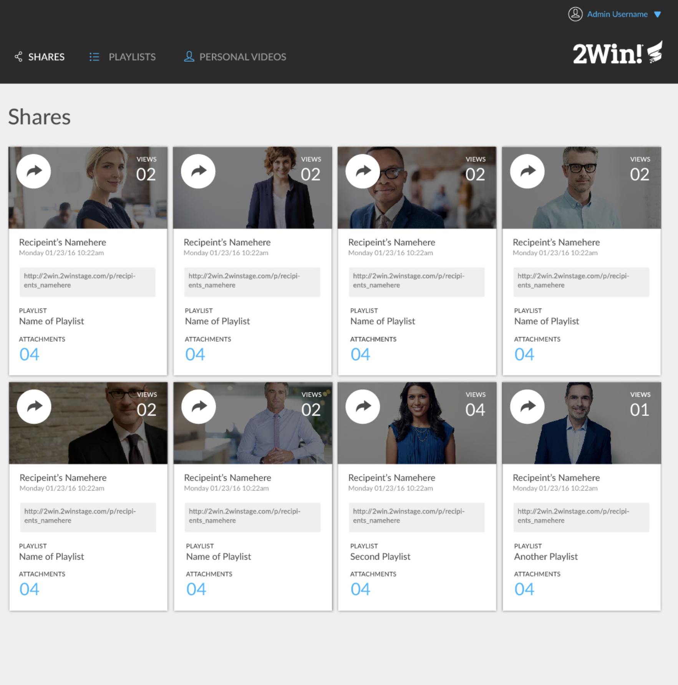
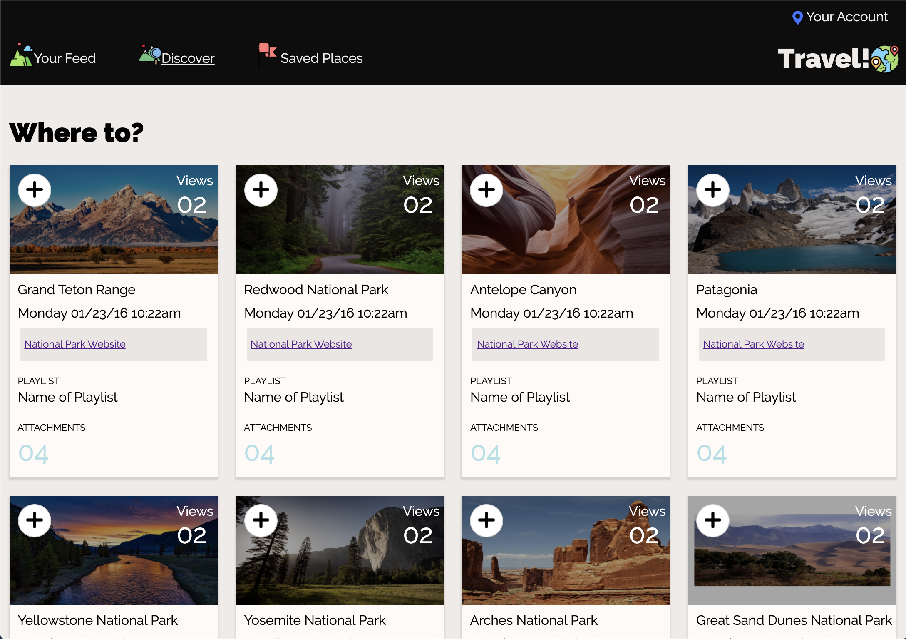

# Comp Challenge 1  

Mod 1 Static Composition Challenge  

Nick Hart

## Overview  

This static composition challenge is a responsive webpage intended to mimic the UI of a provided example using HTML, CSS grid and CSS gridbox. I was given creative license to alter the copy, photos, color palette, and icons.  

## Successes  

- **CSS Grid & Flexbox**: I feel much more confident utilizing CSS grid and flexbox in tandem to ensure sites are
responsive.  
- **Semantic HTML**: The practice I got on creating a pretty involved page from scratch really taught me the importance
of semantics in keeping code readable.

## Template  

## My Page  

## Image and Icon Credits  

Images by:
- [ArtTower](https://pixabay.com/users/ArtTower-5337/?utm_source=link-attribution&amp;utm_medium=referral&amp;utm_campaign=image&amp;utm_content=53621) from
[Pixabay]( https://pixabay.com/?utm_source=link-attribution&amp;utm_medium=referral&amp;utm_campaign=image&amp;utm_content=53621)  
- [David Mark](https://pixabay.com/users/12019-12019/?utm_source=link-attribution&amp;utm_medium=referral&amp;utm_campaign=image&amp;utm_content=1587301) from
[Pixabay]( https://pixabay.com/?utm_source=link-attribution&amp;utm_medium=referral&amp;utm_campaign=image&amp;utm_content=1587301)  
- [knobbyB]( https://pixabay.com/users/knobbyB-16334231/?utm_source=link-attribution&amp;utm_medium=referral&amp;utm_campaign=image&amp;utm_content=5121573 ) from
[Pixabay]( https://pixabay.com/?utm_source=link-attribution&amp;utm_medium=referral&amp;utm_campaign=image&amp;utm_content=5121573)  
- [Free-Photos]( https://pixabay.com/photos/?utm_source=link-attribution&amp;utm_medium=referral&amp;utm_campaign=image&amp;utm_content=690046) from
[Pixabay]( https://pixabay.com/?utm_source=link-attribution&amp;utm_medium=referral&amp;utm_campaign=image&amp;utm_content=690046 )  
- [PatternPictures]( https://pixabay.com/users/PatternPictures-622877/?utm_source=link-attribution&amp;utm_medium=referral&amp;utm_campaign=image&amp;utm_content=1128815 ) from
[Pixabay]( https://pixabay.com/?utm_source=link-attribution&amp;utm_medium=referral&amp;utm_campaign=image&amp;utm_content=1128815)  

Icons from flaticon.com by:
- [Freepik]( http://www.freepik.com/)  
- [Smashicons](https://smashicons.com/)  
- [Payungkead](https://www.flaticon.com/free-icon/mountain_1847078?term=hills&page=2&position=64)
- [inipagistudio]( https://www.flaticon.com/authors/inipagistudio )  
- [srip](https://www.flaticon.com/authors/srip)
